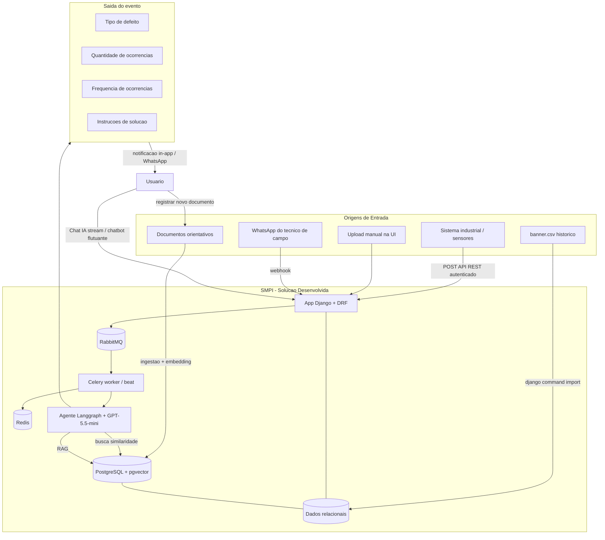
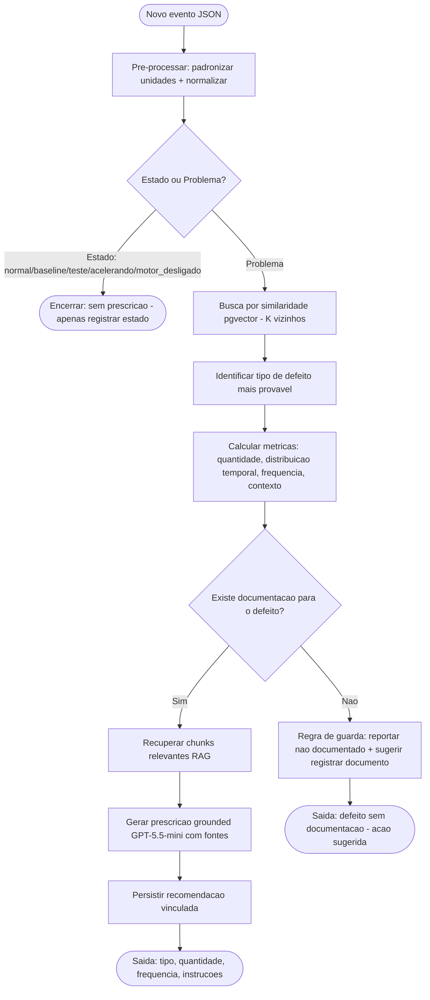
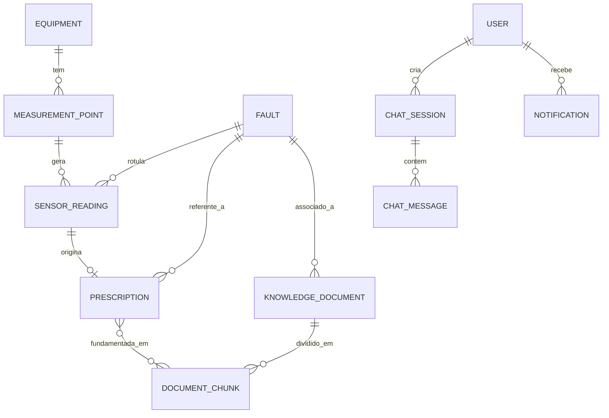
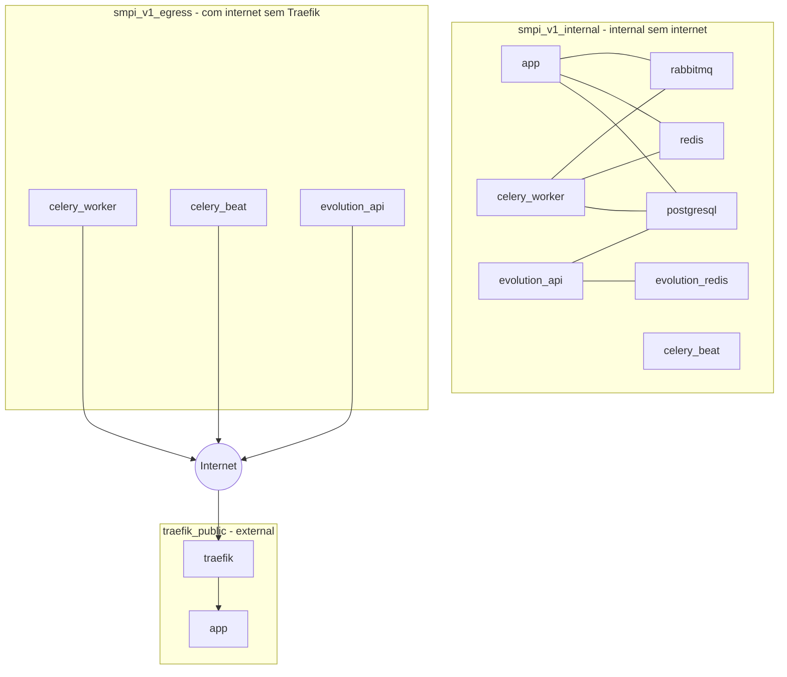

# PRD — Sistema de Manutenção Prescritiva Inteligente (SMPI)

| Campo | Valor |
|---|---|
| **Produto** | SMPI — Sistema de Manutenção Prescritiva Inteligente |
| **Versão do documento** | 1.1 |
| **Data** | 2026-06-27 |
| **Autor** | Arquitetura de Software / Tech Lead |
| **Status** | Implementado (Sprints 0–12 concluídos) |
| **Stack-base** | Python 3.13 · Django 6.0 · LangChain · LangGraph · PostgreSQL + pgvector · Celery · RabbitMQ · Redis · Docker Swarm · Traefik |

> **Placeholders ajustáveis (find/replace):** `smpi.digital` (domínio), `ghcr.io/pycodebr/smpi_v1` (registry), `pycodebr` (org GitHub) são valores de exemplo. Substitua conforme o ambiente real antes do deploy. Ver Seção 21.

> **Nota de implementação (v1.1):** O LLM utilizado na implementação real é `gpt-4o-mini` (OpenAI), configurável via `LLM_MODEL` no `.env`. A fonte tipográfica MuseoSans foi substituída por **Nunito** (Google Fonts) por restrição de CORS no CDN FIESC.

---

## 1. Visão geral, objetivos e personas

### 1.1 Visão geral

O **SMPI** é um sistema **single-tenant** (dedicado a uma única organização industrial) que leva a manutenção **preditiva** (prever *quando* um equipamento vai falhar) para a manutenção **prescritiva** (indicar *o que fazer* para corrigir a falha). Equipamentos rotativos de chão de fábrica, instrumentados com sensores de vibração, enviam continuamente métricas estatísticas. Ao receber um novo evento, o sistema localiza ocorrências históricas similares, identifica o tipo de defeito, recupera a documentação técnica relacionada e gera uma **recomendação prescritiva fundamentada exclusivamente na base documental da empresa** (grounded, anti-alucinação).

### 1.2 Objetivos

- Detectar e contextualizar anomalias a partir de dados de sensores, **sem depender de classificação prévia de falhas conhecidas** (abordagem por similaridade).
- Entregar, para cada novo evento: **Tipo de defeito**, **Quantidade de ocorrências**, **Frequência de ocorrências** e **Instruções de solução**.
- Garantir que toda recomendação seja **grounded** em documentos; na ausência de documentação, **reportar** e **solicitar o registro** de um novo documento orientativo — nunca inventar solução.
- Operar a inferência em **estação de trabalho comercial** (até 32 GB RAM / GPU 16 GB).
- Oferecer interação por **dashboard**, **chat com IA (stream)**, **chatbot flutuante** e **WhatsApp**.

### 1.3 Métricas de sucesso (KPIs)

| KPI | Meta inicial |
|---|---|
| Cobertura de recomendações grounded (sem alucinação) | 100% das recomendações com fonte documental |
| Tempo de resposta da análise de um novo evento | ≤ 30 s (assíncrono, não bloqueante) |
| Latência do chat (primeiro token) | ≤ 3 s (stream) |
| Operação dentro do limite de hardware | 100% (32 GB RAM / 16 GB GPU) |
| Controle de acesso por perfil | 0 acessos indevidos a recursos restritos |

---

## 2. Sumário executivo

O SMPI resolve a dor de equipes de manutenção que, diante de um sintoma de vibração anômalo, não sabem **qual ação tomar**. O sistema combina três capacidades: (1) **análise de dados** dos sensores; (2) **busca por similaridade** vetorial sobre o histórico operacional; e (3) **recuperação de conhecimento (RAG)** sobre a base documental, orquestradas por um **agente Langgraph** que produz a prescrição. O sistema é entregue para uma única organização, com deploy resiliente em Docker Swarm e uma trilha de operação **on-premise** para ambientes industriais com restrição de conectividade ou exigência de soberania de dados.

---

## 3. Personas e atores

| Persona / Ator | Descrição | Necessidades principais |
|---|---|---|
| **Administrador da planta** (Dono/Gerente) | Gerencia a organização, usuários, equipamentos e a base documental. | Visão geral (dashboard), gestão de cadastros, controle de acessos, relatórios. |
| **Técnico de manutenção** | Analisa eventos, recebe recomendações e executa ações. | Recomendações prescritivas claras, histórico de ocorrências, chat com IA. |
| **Técnico de campo (via WhatsApp)** | Opera no chão de fábrica, sem acesso ao desktop. | Consultar/registrar eventos e receber recomendações pelo WhatsApp. |
| **Sistema industrial / Gateway de sensores** (ator não-humano) | Envia eventos de sensores automaticamente. | Endpoint REST autenticado (API key do sistema) para POST de eventos. |
| **Engenheiro de confiabilidade / Gestor** | Acompanha indicadores de saúde e tendências. | Dashboards, frequência de defeitos, ranking de equipamentos, exportações. |

---

## 4. Escopo

### 4.1 Incluído

- Gestão de usuários (login por email), equipamentos e pontos de medição/sensores da organização.
- Ingestão de eventos (API REST, importação `banner.csv`, upload manual, WhatsApp opcional).
- Catálogo de defeitos com distinção **estado vs problema**.
- Motor de similaridade (pgvector), RAG sobre base documental, agente prescritivo Langgraph com **regra de guarda**.
- Dashboards, relatórios (PDF/CSV), chat com IA (stream), chatbot flutuante, integração WhatsApp (Evolution API), notificações in-app.
- Documentação MkDocs (aba no site) e Swagger (aba no site), acessibilidade (VLibras + HTML semântico).
- Deploy em Docker Swarm com Traefik, TLS wildcard (Cloudflare DNS-01), Docker Secrets, scripts de deploy/backup.

### 4.2 Fora de escopo (nesta versão)

- Arquitetura **multi-tenant** / SaaS para múltiplas empresas (o sistema atende **uma única organização**).
- **Testes** automatizados (não serão implementados).
- Treinamento de modelos em produção (o treinamento/ajuste ocorre offline; a operação roda inferência).
- Apps mobile nativos (a experiência mobile é via web responsiva + WhatsApp).

---

## 5. Arquitetura da solução

### 5.1 Componentes

- **Traefik** — ingress, TLS wildcard (Let's Encrypt via DNS-01/Cloudflare), load balancer.
- **App Django** — web, API REST (DRF), autenticação e permissões, templates, chat (SSE), webhooks.
- **PostgreSQL + pgvector** — dados relacionais + vetores (similaridade de sensores e embeddings RAG).
- **Celery (worker + beat)** — tarefas assíncronas (análise de eventos, RAG, resumos, ingestão).
- **RabbitMQ** — broker do Celery. **Redis** — result backend do Celery + cache do app.
- **Evolution API** + **evolution_redis** — integração WhatsApp (cache dedicado, isolado).
- **Modelos de IA** — LLM `GPT-5.5-mini` (OpenAI) via Langchain/Langgraph; embeddings locais (sentence-transformers).

### 5.2 Fluxo (conforme o diagrama do case)

Entrada (novo evento JSON) + base de dados histórica + documentos orientativos → **Solução desenvolvida** (similaridade + RAG + agente prescritivo) → **Saída**: Tipo de defeito, Quantidade de ocorrências, Frequência de ocorrências, Instruções de solução. O usuário interage por **Chat** e pode **registrar novos documentos orientativos**.



---

## 6. Arquitetura técnica de implantação em ambiente industrial

### 6.1 Topologias suportadas

1. **VPS gerenciada (padrão).** Stack em Docker Swarm, Traefik com TLS wildcard, LLM via API (OpenAI). Recomendada para a maioria dos casos.
2. **On-premise industrial (opcional).** Mesmo stack rodando em servidor/estação na planta, com **LLM local** (Ollama/vLLM, modelo quantizado ≤ 16 GB GPU) e embeddings locais — para ambientes sem conectividade externa ou com exigência de soberania de dados. O **provider de LLM é configurável no `.env`**.

### 6.2 Restrição de operação (CRÍTICA)

O **treinamento/ajuste** de modelos (scaler, classificador estado-vs-problema, tuning de índices) **pode** usar infraestrutura de alto desempenho. A **operação** (inferência, similaridade, RAG, recomendação) **deve** caber em uma **estação de trabalho comercial com até 32 GB de RAM e GPU de 16 GB**. Decisões de projeto que garantem isso:

- **Embeddings locais leves** (sentence-transformers multilíngue, ~1–2 GB) — não dependem de GPU de grande porte.
- **Similaridade via pgvector/ANN** (IVFFlat/HNSW) — escala em CPU/RAM, sem carregar todo o histórico em memória.
- **LLM via API** (operação leve no host) **ou** **LLM local quantizado** que caiba em 16 GB de GPU.

### 6.3 Integração industrial

- **Ingestão automática**: endpoint REST autenticado por **API key do sistema** (sistemas SCADA/gateways fazem POST do evento JSON).
- **Borda humana**: técnicos de campo interagem por **WhatsApp** (Evolution API), sem necessidade de desktop.
- **Importação em lote**: `banner.csv` e documentos via django commands.

```mermaid
flowchart LR
    subgraph PLANTA[Chao de fabrica]
        GW[Gateway de sensores SCADA]
        TEC[Tecnico de campo]
    end
    subgraph VPS[VPS - Docker Swarm]
        TR[Traefik TLS wildcard]
        SMPI[Stack SMPI]
    end
    OAI[OpenAI GPT-5.5-mini]
    META[WhatsApp / Meta]

    GW -->|HTTPS POST evento| TR --> SMPI
    TEC -->|WhatsApp| META --> SMPI
    SMPI -->|egress| OAI
    SMPI -->|egress| META

    ONP[Alternativa on-premise: LLM local Ollama/vLLM ate 16GB GPU] -.configuravel no .env.- SMPI
```

---

## 7. Pipeline de IA

Esta é a seção central do sistema. O pipeline roda de forma **assíncrona (Celery)** ao receber um novo evento e é orquestrado por um **grafo Langgraph**.

### 7.1 Pré-processamento

- **Seleção e padronização de unidades**: o evento traz métricas redundantes (in/s e mm/s; °F e °C). O sistema **deve** padronizar para o **sistema métrico** (mm/s, °C) de forma consistente, descartando/ignorando as colunas redundantes na construção do vetor de features.
- **Normalização/escala**: aplicar `StandardScaler` (ou equivalente) ajustado na base histórica e persistido (artefato versionado). O mesmo scaler é reaplicado a cada novo evento.
- **Vetor de features**: o resultado é um vetor numérico normalizado, armazenado em coluna `pgvector` para busca ANN.

### 7.2 Classificação estado vs problema (CRÍTICO)

Os rótulos da coluna `fault` `normal`, `baseline`, `teste`, `acelerando`, `motor_desligado` são **ESTADOS** (não problemas) e **nunca** geram recomendação prescritiva. Todos os demais rótulos são **PROBLEMAS**. O classificador (treinado/ajustado com os rótulos históricos) decide se o evento representa estado ou problema; **estados encerram o fluxo** sem prescrição.

### 7.3 Busca por similaridade

- Encontrar os **K vizinhos mais próximos** do vetor de features do novo evento no histórico (pgvector, distância L2/cosseno, índice IVFFlat ou HNSW), **sem depender de classificação prévia**.
- Entre os vizinhos rotulados como **problema**, identificar o **tipo de defeito mais provável** (ex.: votação ponderada por similaridade).

### 7.4 Métricas de correlação

A partir dos vizinhos/ocorrências do mesmo defeito: **quantidade de ocorrências** similares, **distribuição ao longo do tempo**, **frequência de ocorrência** e **contexto operacional** associado (ex.: faixa de RPM, equipamento, ponto de medição).

### 7.5 RAG e geração prescritiva (grounded)

- Recuperar, na base documental (pgvector), os **chunks relevantes** ao defeito identificado.
- O LLM (`GPT-5.5-mini`) gera a **recomendação prescritiva** (inspeção/manutenção/correção) **fundamentada apenas nos documentos recuperados**, citando as fontes.

### 7.6 Regra de guarda (anti-alucinação, CRÍTICO)

Se **não houver documentos** para o defeito identificado (ou a recuperação não retornar conteúdo relevante), o sistema **não inventa solução**: reporta que o problema **ainda não está documentado** e oferece o fluxo para **registrar um novo documento orientativo**.

### 7.7 Saída estruturada

A saída do evento contém exatamente: **Tipo de defeito**, **Quantidade de ocorrências**, **Frequência de ocorrências**, **Instruções de solução** (com referência aos documentos-fonte). A recomendação é **persistida** e vinculada ao evento/leitura, ao equipamento e ao defeito.



---

## 8. Tratamento dos dados do `banner.csv` e da base documental

### 8.1 `banner.csv` (base histórica de leituras)

Colunas: `id` (identificação do registro), `created_at` (data de criação), `fault` (condição anotada manualmente pelo operador) e as demais colunas de **métricas estatísticas** dos sensores de vibração em diferentes pontos de uma máquina rotativa.

**Exemplo de evento (JSON):**

```json
{"id":114387,"created_at":"2026-06-01 21:32:53.911176+00:00","z_rms_velocity_in_s":0.0597,"z_rms_velocity_mm_s":1.517,"temperature_f":76.44,"temperature_c":24.69,"x_rms_velocity_in_s":0.0787,"x_rms_velocity_mm_s":2.0,"z_peak_acceleration_g":0.484,"x_peak_acceleration_g":0.631,"z_peak_vel_comp_freq_hz":61.0,"x_peak_vel_comp_freq_hz":61.0,"z_rms_acceleration_g":0.09,"x_rms_acceleration_g":0.114,"z_kurtosis":2.392,"x_kurtosis":2.77,"z_crest_factor":3.747,"x_crest_factor":4.269,"z_peak_velocity_in_s":0.0844,"z_peak_velocity_mm_s":2.146,"x_peak_velocity_in_s":0.1113,"x_peak_velocity_mm_s":2.829,"z_high_freq_rms_accel_g":0.129,"x_high_freq_rms_accel_g":0.147,"fault":"cocked_rotor_2","rpm":1000.0}
```

**Mapa estado vs problema:**

| `fault` | Classificação |
|---|---|
| `normal`, `baseline`, `teste`, `acelerando`, `motor_desligado` | **Estado** (não gera prescrição) |
| Qualquer outro rótulo (ex.: `cocked_rotor_2`) | **Problema** (entra no pipeline prescritivo) |

**Pipeline de importação** (`django command import_banner`): valida cabeçalho, normaliza unidades, popula `Fault` (com `is_problem`), cria/atualiza `SensorReading`, computa o `feature_vector` (pgvector) e ajusta/atualiza o índice ANN. Idempotente por `id`.

### 8.2 Base documental (RAG)

Documentos fornecidos pela empresa (manuais, procedimentos, relatórios técnicos, registros de manutenção). Pipeline de ingestão (`django command ingest_documents`): extração de texto (PDF/DOCX/TXT) → **chunking** (com sobreposição) → **embedding** (sentence-transformers, local) → persistência em `DocumentChunk` (`pgvector`) com metadados (documento, defeito/tags). A recuperação é **escopada por defeito**.

---

## 9. Modelo de dados

O sistema é **single-tenant** (atende uma única organização industrial). Todos os models herdam de uma base com `created_at` e `updated_at`. O controle de acesso é por **usuário/perfil** (autenticação e permissões nativas do Django); não há separação por tenant.



### 9.1 Principais entidades

**Organization** (configuração — registro único; identidade da empresa para branding/relatórios; **não** é um tenant)

| Campo | Tipo | Notas |
|---|---|---|
| id | PK | |
| corporate_name | varchar | Razão Social |
| cnpj | varchar(14) | Opcional |
| logo | imagefield | Opcional (branding/relatórios) |
| created_at / updated_at | datetime | |

**User** (auth nativa, login por email)

| Campo | Tipo | Notas |
|---|---|---|
| id | PK | |
| email | varchar | Único, usado no login |
| role | varchar | admin / maintenance / viewer |
| is_active, is_staff | bool | |
| created_at / updated_at | datetime | |

**Equipment**

| Campo | Tipo | Notas |
|---|---|---|
| id | PK | |
| name | varchar | |
| equipment_type | varchar | Ex.: motor, bomba |
| sector | varchar | Planta/setor |
| status | varchar | active / inactive / maintenance |
| created_at / updated_at | datetime | |

**MeasurementPoint** (sensor)

| Campo | Tipo | Notas |
|---|---|---|
| id | PK | |
| equipment_id | FK Equipment | |
| axis | varchar | X / Z |
| sensor_type | varchar | |
| created_at / updated_at | datetime | |

**Fault** (catálogo de defeitos/estados)

| Campo | Tipo | Notas |
|---|---|---|
| id | PK | |
| code | varchar | Ex.: `cocked_rotor_2`, `normal` |
| name | varchar | |
| is_problem | bool | `false` para estados |
| description | text | |
| created_at / updated_at | datetime | |

**SensorReading** (evento/leitura)

| Campo | Tipo | Notas |
|---|---|---|
| id | PK | |
| measurement_point_id | FK MeasurementPoint | |
| external_id | bigint | `id` de origem (idempotência) |
| metrics | jsonb | Métricas brutas (todas as colunas) |
| feature_vector | vector(N) | pgvector (normalizado) |
| fault_id | FK Fault | Rótulo anotado (quando houver) |
| status_class | varchar | state / problem (classificado) |
| rpm | float | |
| event_created_at | datetime | `created_at` da origem |
| created_at / updated_at | datetime | |

**KnowledgeDocument** / **DocumentChunk**

| KnowledgeDocument | Tipo | Notas |
|---|---|---|
| id | PK | |
| title | varchar | |
| file | filefield | Protegido por permissão |
| fault_id | FK Fault (nullable) | Associação ao defeito |
| tags | varchar | |
| created_at / updated_at | datetime | |

| DocumentChunk | Tipo | Notas |
|---|---|---|
| id | PK | |
| document_id | FK KnowledgeDocument | |
| content | text | |
| embedding | vector(N) | pgvector |
| created_at / updated_at | datetime | |

**Prescription** (recomendação)

| Campo | Tipo | Notas |
|---|---|---|
| id | PK | |
| sensor_reading_id | FK SensorReading | |
| fault_id | FK Fault | |
| defect_type | varchar | Saída: tipo de defeito |
| occurrences_count | int | Saída: quantidade |
| occurrences_frequency | varchar | Saída: frequência |
| instructions | text | Saída: instruções (markdown) |
| source_chunks | M2M DocumentChunk | Fundamentação |
| is_grounded | bool | `false` quando acionou regra de guarda |
| created_at / updated_at | datetime | |

**ChatSession / ChatMessage / Notification / ApiKey / WhatsAppMessage** — sessões de chat por usuário; mensagens (role, content markdown); notificações in-app (lida/não lida); API key(s) do sistema para ingestão (nível de aplicação); log de mensagens WhatsApp (in/out). Todos com `created_at` e `updated_at`.

---

## 10. Especificação funcional detalhada (por módulo/app)

| App | Responsabilidade | Itens principais |
|---|---|---|
| **core** | Projeto Django, `settings.py` único, URLs raiz, healthcheck `/health/`. | Landing page, roteamento, configurações. |
| **base** | Recursos compartilhados. | `TimeStampedModel` (created_at/updated_at), mixins de permissão e middleware de proteção de media. |
| **accounts** | Usuários e autenticação. | Login por **email**, gestão de usuários pelo admin, recuperação de senha (email nativo), papéis/permissões. |
| **assets** | Ativos. | CRUD de Equipment e MeasurementPoint, status, anexos protegidos. |
| **monitoring** | Leituras/eventos. | Ingestão (API/CSV/manual/WhatsApp), listagem/filtros, detalhe do evento, disparo da análise. |
| **faults** | Catálogo de defeitos. | CRUD de Fault com `is_problem`, mapa estado vs problema. |
| **knowledge** | Base documental/RAG. | Upload de documentos, ingestão/chunking/embedding, associação a defeitos, **registro de novo documento** (regra de guarda). |
| **prescriptions** | Recomendações. | Geração (Celery), persistência, exibição da saída estruturada, fontes. |
| **analytics** | Dashboards. | Métricas, gráficos (séries temporais, barras, distribuições, ranking), insights. |
| **reports** | Relatórios. | Geração PDF (Reportlab/PyPDF) e CSV, tela/menu dedicados. |
| **ai** | Agentes e chat. | Grafo Langgraph, tools (DB + RAG), sessões de chat, chat stream (SSE), chatbot flutuante, resumos com IA. |
| **notifications** | Notificações in-app. | Criação/leitura, push na interface ao concluir tasks. |
| **whatsapp** | Evolution API. | Webhook de entrada, envio via REST, gestão de instância. |
| **api** | API REST + Swagger. | DRF, autenticação por API key do sistema, drf-spectacular (Swagger/OpenAPI). |

### 10.1 Regras funcionais transversais

- **Resumir com IA**: botão em equipamento, ocorrência/evento e histórico — dispara agente (Celery), gera resumo com insights, salva em campo de texto e **notifica** ao concluir. Não bloqueante (loading + aviso).
- **Não bloqueante**: toda task pesada exibe loading no botão + aviso "você será notificado" e gera **notificação in-app** (e WhatsApp quando aplicável) ao terminar.
- **Landing/login** (`smpi.digital`): apresentação do sistema e **login** dos usuários da organização; recuperação de senha por email nativo. A criação de usuários é feita pelo **administrador** (sem autocadastro de empresas nem planos).

---

## 11. Requisitos não funcionais

- **Responsividade**: funcionar em telas de todos os tamanhos.
- **Segurança / controle de acesso**: rotas fechadas, autenticação e permissões por perfil; arquivos/media visíveis **apenas** a usuários autorizados (middleware de proteção de media), nunca expostos.
- **API segura**: ingestão autenticada por **API key do sistema**; todos os endpoints exigem autenticação e respeitam as permissões.
- **UI/UX**: fluidez das jornadas, bom contraste (elementos, fontes, fundo), conforme o **design system** (`@design_system/design-system.html`).
- **Acessibilidade**: HTML semântico, **VLibras**, contraste e navegação por teclado (boas práticas WCAG).
- **Não bloqueante**: tasks pesadas via Celery, loading + notificação ao concluir.
- **Anti-alucinação**: respostas/recomendações **grounded**; sem documentação → reportar + sugerir registro, sem inventar.
- **Operação**: inferência cabe em **32 GB RAM / GPU 16 GB**.
- **Desempenho**: filtros/telas/processos rápidos; similaridade com índices vetoriais (pgvector).
- **Resiliência (Swarm)**: `restart_policy` (on-failure, delay, max_attempts, window) e `resource limits` (limits/reservations de CPU e memória) por serviço.
- **Zero-downtime**: `update_config` com `order: start-first` e `failure_action: rollback`.
- **Subida ordenada/auto-recuperável**: healthchecks + `wait_for_db` + `restart_policy` com delay; sem crash-loop por dependência.
- **Egress**: serviços que chamam API externa (celery_worker/beat → OpenAI; evolution_api → WhatsApp) na rede `smpi_v1_egress`; **nunca** em `traefik_public`.
- **collectstatic**: sempre com `--clear` no entrypoint.
- **Segredos**: nunca em texto puro versionado (Docker Secrets e/ou `.env` gitignored).

---

## 12. Integrações

### 12.1 API REST (DRF) + Swagger

- Construída com **Django REST Framework**; documentada com **drf-spectacular** (Swagger UI + schema OpenAPI; Redoc opcional).
- **Swagger UI** disponível em aba do site (`/api/docs/`).
- Autenticação de ingestão por **API key do sistema** (header). Demais endpoints por sessão/token, sempre autenticados.

**Endpoints principais (exemplos):**

| Método | Rota | Descrição | Auth |
|---|---|---|---|
| POST | `/api/v1/readings/` | Ingestão de novo evento (JSON) | API key (sistema) |
| GET | `/api/v1/readings/` | Listagem de leituras (filtros) | Sessão/Token |
| GET | `/api/v1/readings/{id}/` | Detalhe + saída estruturada | Sessão/Token |
| GET | `/api/v1/prescriptions/{id}/` | Recomendação e fontes | Sessão/Token |
| POST | `/api/v1/documents/` | Upload de documento orientativo | Sessão/Token |
| POST | `/api/v1/chat/sessions/{id}/messages/` | Mensagem ao agente (stream SSE) | Sessão/Token |
| POST | `/webhooks/whatsapp/` | Recebimento de mensagens (Evolution) | Assinatura/token webhook |
| GET | `/api/schema/` · `/api/docs/` | OpenAPI · Swagger UI | Pública/Sessão |

### 12.2 Evolution API / WhatsApp

- **Envio**: o Django chama a **REST da Evolution API** (rede interna) para enviar notificações/alertas/respostas do agente.
- **Recebimento**: a Evolution API envia eventos de mensagem ao **webhook do Django** (`/webhooks/whatsapp/`).
- **Persistência**: a Evolution API usa **banco separado no mesmo PostgreSQL** e **cache no `evolution_redis` dedicado** (isolado do redis principal).
- **Segurança**: API key da Evolution como **secret**; serviço **não exposto** publicamente (apenas o app acessa); manager (se exposto) atrás do Traefik com **basic auth**. A Evolution conecta ao WhatsApp pela rede **`smpi_v1_egress`**.

---

## 13. Dashboards e relatórios

### 13.1 Dashboard (app `analytics`)

| Visualização | Tipo de gráfico |
|---|---|
| Distribuição de ocorrências ao longo do tempo | Série temporal (linha/área) |
| Frequência por tipo de defeito | Barras |
| Distribuição de tipos de defeito | Pizza/Donut |
| Ranking de equipamentos com mais problemas | Barras horizontais |
| Tendência das métricas de vibração (RMS, pico) | Série temporal |
| Status de saúde dos equipamentos | Cartões/indicadores |

Cartões de topo: total de equipamentos monitorados, leituras recebidas, eventos/problemas detectados, defeitos mais frequentes, **insights** gerados por IA.

### 13.2 Relatórios (app `reports`)

Menu e tela dedicados, exportáveis em **PDF (Reportlab/PyPDF)** e **CSV**:

- Histórico de eventos/leituras (por período/equipamento).
- Frequência de defeitos.
- Recomendações geradas (com fontes).
- Equipamentos e saúde.
- Ocorrências por período.

---

## 14. Chatbot flutuante e tela de chat

- **Tela de chat** (menu lateral): sessões salvas **por usuário**; o agente tem **tools** de acesso à base de dados (equipamentos, leituras, defeitos, histórico, similaridade) e à **base documental (RAG)**. Responde **com base nos dados/documentos da organização**, respeitando a **regra de guarda**.
- **Streaming**: resposta em efeito **stream** via **SSE** (`StreamingHttpResponse`), token a token. A resposta vem em **markdown** e o template a renderiza para **HTML**.
- **Chatbot flutuante**: janela suspensa no canto, disponível nas telas autenticadas, com **botão para ocultar/exibir**; usa o **mesmo agente** prescritivo, com stream e markdown.
- **Separação de cargas**: o chat interativo **streama em tempo real** a partir da view; tarefas pesadas disparadas por botão (resumos, geração de recomendação de evento) rodam em **Celery** com notificação ao concluir.

---

## 15. Acessibilidade

- **VLibras**: integrar o widget oficial de tradução para **Libras** em todas as páginas.
- **HTML semântico**: usar `header`, `nav`, `main`, `section`, `article`, `aside`, `footer`, landmarks e **ARIA** corretos para leitura por VLibras e leitores de tela.
- **Contraste e teclado**: bom contraste (conforme design system) e navegação por teclado, visando conformidade com boas práticas **WCAG**.

---

## 16. Documentação

- **MkDocs**: pasta `docs/` com documentação sempre atualizada, servida online, com **suporte a mermaid** (`mkdocs` + tema + plugin mermaid). Disponível em **aba do site** ("Documentação").
- **Swagger**: API documentada com **drf-spectacular**, **Swagger UI** em **aba do site** ("API"), além do schema OpenAPI (e Redoc opcional).

---

## 17. Infraestrutura, serviços Docker, volumes e redes

### 17.1 Serviços do stack

`app` (Django), `postgresql`, `celery_worker`, `celery_beat`, `rabbitmq`, `redis` (result backend + cache), `evolution_api`, `evolution_redis` (cache dedicado, isolado) e `traefik`.

### 17.2 Volumes nomeados

`postgresql`, `redis`, `rabbitmq`, `media`, `staticfiles`, certificados Let's Encrypt (`letsencrypt`), dados de instâncias da Evolution (`evolution_instances`), `evolution_redis` e `model_cache` (cache de modelos de embedding).

### 17.3 Redes overlay e matriz de placement (CRÍTICO)

São exatamente **3 redes**: `traefik_public` (external, ingress HTTP, com internet), `smpi_v1_internal` (`internal: true`, sem internet) e `smpi_v1_egress` (overlay com internet, sem Traefik).

| Serviço | traefik_public | smpi_v1_internal | smpi_v1_egress |
|---|:---:|:---:|:---:|
| traefik | ✅ | — | — |
| app | ✅ | ✅ | — |
| postgresql | — | ✅ | — |
| redis | — | ✅ | — |
| rabbitmq | — | ✅ | — |
| evolution_redis | — | ✅ | — |
| evolution_api | — | ✅ | ✅ |
| celery_worker | — | ✅ | ✅ |
| celery_beat | — | ✅ | ✅ |

> **NUNCA** colocar `celery_worker`, `celery_beat` ou `evolution_api` em `traefik_public`. Serviços puramente internos (`postgresql`, `redis`, `rabbitmq`, `evolution_redis`) ficam **apenas** em `smpi_v1_internal`.



### 17.4 Resiliência

- `restart_policy`: `condition: on-failure`, com `delay`, `max_attempts` e `window`.
- `resources`: `limits` e `reservations` de CPU e memória por serviço (evita starvation da VPS).
- `update_config` do `app`: `order: start-first`, `failure_action: rollback`.
- **Healthchecks**: `app` (HTTP `/health/`), `postgresql` (`pg_isready`), `redis`/`evolution_redis` (`redis-cli ping`), `rabbitmq` (`rabbitmq-diagnostics check_port_connectivity`), `evolution_api` (HTTP status). `start_period` adequado.
- **Ordem de subida**: garantida por healthchecks + `wait_for_db` nos entrypoints (Swarm ignora `depends_on` em runtime).

---

## 18. Segurança e segredos

- **Docker Secrets** (preferência para credenciais de produção) e **`.env` gitignored** (separado para dev e prod).
- Token do Cloudflare como secret `CLOUDFLARE_DNS_API_TOKEN`, lido pelo Traefik via `CF_DNS_API_TOKEN_FILE=/run/secrets/CLOUDFLARE_DNS_API_TOKEN`. **Nunca** em texto puro.
- **Controle de acesso**: autenticação e permissões por perfil em todas as views; **proteção de media** por middleware (acesso só a quem tem permissão).
- **Proxy/HTTPS**: `SECURE_PROXY_SSL_HEADER=('HTTP_X_FORWARDED_PROTO','https')`, `SECURE_REDIRECT_EXEMPT` para `/health/`, Traefik com `trustedIPs` do Cloudflare e redirect http→https.
- **`.env` em scripts**: parser seguro de `KEY=VALUE`; **nunca** `source`/`.` (caracteres `& $ * @` quebram o shell).

### 18.1 Tabela de secrets

| Secret | Uso | Onde é lido |
|---|---|---|
| `CLOUDFLARE_DNS_API_TOKEN` | DNS-01 (cert wildcard) | Traefik (`CF_DNS_API_TOKEN_FILE`) |
| `POSTGRES_PASSWORD` | Senha do PostgreSQL | app, celery, evolution_api |
| `RABBITMQ_PASSWORD` | Senha do RabbitMQ | app, celery |
| `REDIS_PASSWORD` | Senha do redis principal (`requirepass`) | app, celery |
| `EVOLUTION_REDIS_PASSWORD` | Senha do `evolution_redis` | evolution_api |
| `OPENAI_API_KEY` | LLM `GPT-5.5-mini` | celery_worker/beat |
| `EVOLUTION_API_KEY` | Auth da Evolution API | app, evolution_api |
| `DJANGO_SECRET_KEY` | `SECRET_KEY` do Django | app, celery |

---

## 19. Guia de deploy em VPS Ubuntu (do zero)

> Pré-requisitos: VPS Ubuntu 22.04/24.04, acesso `sudo`, domínio `smpi.digital` no Cloudflare, conta no GHCR. Substitua os placeholders pelo seu ambiente.

### 19.1 Preparação do servidor e instalação do Docker

```bash
# Atualizar o sistema
sudo apt-get update && sudo apt-get upgrade -y

# Dependências básicas
sudo apt-get install -y ca-certificates curl gnupg git ufw

# Repositório oficial do Docker
sudo install -m 0755 -d /etc/apt/keyrings
curl -fsSL https://download.docker.com/linux/ubuntu/gpg | sudo gpg --dearmor -o /etc/apt/keyrings/docker.gpg
sudo chmod a+r /etc/apt/keyrings/docker.gpg
echo "deb [arch=$(dpkg --print-architecture) signed-by=/etc/apt/keyrings/docker.gpg] \
  https://download.docker.com/linux/ubuntu $(. /etc/os-release && echo "$VERSION_CODENAME") stable" \
  | sudo tee /etc/apt/sources.list.d/docker.list > /dev/null

# Instalar Docker Engine + Compose plugin
sudo apt-get update
sudo apt-get install -y docker-ce docker-ce-cli containerd.io docker-buildx-plugin docker-compose-plugin

# Permitir o usuário atual usar docker sem sudo (reabra a sessão depois)
sudo usermod -aG docker "$USER"

# Firewall (libere SSH, HTTP e HTTPS)
sudo ufw allow OpenSSH
sudo ufw allow 80/tcp
sudo ufw allow 443/tcp
sudo ufw --force enable

# Verificar
docker --version && docker compose version
```

### 19.2 Inicializar o Docker Swarm

```bash
# Use o IP público (ou privado de orquestração) da VPS
export VPS_IP="$(curl -s ifconfig.me)"
docker swarm init --advertise-addr "$VPS_IP"

# Confirmar
docker node ls
```

### 19.3 Criar as redes overlay

```bash
# Pública (external) - compartilhada com o Traefik
docker network create --driver overlay --attachable traefik_public

# Interna isolada (sem internet)
docker network create --driver overlay --internal smpi_v1_internal

# Egress (com internet, sem Traefik)
docker network create --driver overlay smpi_v1_egress

# Conferir
docker network ls | grep -E 'traefik_public|smpi_v1_internal|smpi_v1_egress'
```

### 19.4 Criar o token de API do Cloudflare e o Docker Secret

No painel do Cloudflare: **My Profile → API Tokens → Create Token → Create Custom Token**, com permissão **Zone → DNS → Edit** na zona **smpi.digital**. Copie o token gerado.

```bash
# Cria o secret SEM deixar o token no histórico do shell (digite e finalize com Ctrl-D)
docker secret create CLOUDFLARE_DNS_API_TOKEN -
# (cole o token, pressione Enter e depois Ctrl-D)

# Alternativa a partir de variável (evite history; use 'read -s')
read -rs CF_TOKEN && printf '%s' "$CF_TOKEN" | docker secret create CLOUDFLARE_DNS_API_TOKEN - && unset CF_TOKEN
```

### 19.5 Criar os demais secrets

```bash
# Gere senhas fortes e crie os secrets (digite/coleção via stdin, finalize com Ctrl-D)
printf '%s' "$(openssl rand -base64 32)" | docker secret create POSTGRES_PASSWORD -
printf '%s' "$(openssl rand -base64 32)" | docker secret create RABBITMQ_PASSWORD -
printf '%s' "$(openssl rand -base64 32)" | docker secret create REDIS_PASSWORD -
printf '%s' "$(openssl rand -base64 32)" | docker secret create EVOLUTION_REDIS_PASSWORD -
printf '%s' "$(openssl rand -base64 50)" | docker secret create DJANGO_SECRET_KEY -

# Chaves de terceiros (cole o valor real e finalize com Ctrl-D)
docker secret create OPENAI_API_KEY -
docker secret create EVOLUTION_API_KEY -

# Conferir
docker secret ls
```

### 19.6 Configurar o `.env` de produção

```bash
mkdir -p /opt/smpi && cd /opt/smpi
# Clonar o repositório (ajuste a URL/org)
git clone https://github.com/pycodebr/smpi_v1.git .

# Criar o .env de produção (gitignored). Ajuste os valores conforme necessário.
cat > .env << 'ENVEOF'
DEBUG=False
DJANGO_SETTINGS_MODULE=core.settings

# Hosts e CSRF (padrão obrigatório)
ALLOWED_HOSTS=smpi.digital,.smpi.digital,localhost,127.0.0.1
CSRF_TRUSTED_ORIGINS=https://smpi.digital,https://*.smpi.digital

# Banco / broker / cache (senhas vêm dos Docker Secrets em runtime)
POSTGRES_DB=smpi
POSTGRES_USER=smpi
POSTGRES_HOST=postgresql
POSTGRES_PORT=5432

RABBITMQ_USER=smpi
RABBITMQ_HOST=rabbitmq

REDIS_HOST=redis
REDIS_PORT=6379

# Evolution API
EVOLUTION_API_URL=http://evolution_api:8080
EVOLUTION_REDIS_HOST=evolution_redis

# IA (provider configurável: openai | local)
LLM_PROVIDER=openai
LLM_MODEL=GPT-5.5-mini
EMBEDDINGS_MODEL=sentence-transformers/paraphrase-multilingual-MiniLM-L12-v2

# Email (SMTP)
EMAIL_HOST=smtp.seuprovedor.com
EMAIL_PORT=587
EMAIL_USE_TLS=True
[email protected]
DEFAULT_FROM_EMAIL=SMPI <[email protected]>

# Registry / domínio
DOMAIN=smpi.digital
[email protected]
ENVEOF

chmod 600 .env
```

### 19.7 Autenticar no GHCR e publicar a imagem

```bash
# Login no GHCR (use um Personal Access Token com escopo write:packages)
echo "$GHCR_TOKEN" | docker login ghcr.io -u pycodebr --password-stdin

# Build e push (ou use o script da Seção 19.10)
docker build -t ghcr.io/pycodebr/smpi_v1:latest .
docker push ghcr.io/pycodebr/smpi_v1:latest
```

### 19.8 Deploy do stack

```bash
cd /opt/smpi
# O arquivo de stack (ex.: stack.yml) define serviços, healthchecks, restart_policy,
# resource limits, update_config (start-first/rollback), volumes, redes e secrets.
docker stack deploy -c stack.yml --with-registry-auth smpi

# Acompanhar a subida
docker stack services smpi
watch docker service ls
```

### 19.9 Conectar a Evolution API ao WhatsApp

```bash
# A Evolution API fica apenas na rede interna; acesse-a a partir do host via container utilitário,
# ou exponha temporariamente o manager atrás do Traefik com basic auth.

# 1) Criar a instância (substitua a API key pelo valor do secret EVOLUTION_API_KEY)
docker exec -it "$(docker ps -qf name=smpi_app)" \
  curl -s -X POST http://evolution_api:8080/instance/create \
  -H "apikey: $EVOLUTION_API_KEY" -H "Content-Type: application/json" \
  -d '{"instanceName":"smpi","integration":"WHATSAPP-BAILEYS","qrcode":true}'

# 2) Obter o QR Code para pareamento
docker exec -it "$(docker ps -qf name=smpi_app)" \
  curl -s http://evolution_api:8080/instance/connect/smpi \
  -H "apikey: $EVOLUTION_API_KEY"
# Escaneie o QR Code com o WhatsApp (Aparelhos conectados).

# 3) Conferir o status da conexão
docker exec -it "$(docker ps -qf name=smpi_app)" \
  curl -s http://evolution_api:8080/instance/connectionState/smpi \
  -H "apikey: $EVOLUTION_API_KEY"
```

### 19.10 Verificações pós-deploy

```bash
# Healthcheck do app
curl -fsS https://smpi.digital/health/ && echo "  -> app OK"

# Certificado wildcard (DNS-01) — verifique o SAN cobrindo *.smpi.digital
echo | openssl s_client -servername smpi.digital -connect smpi.digital:443 2>/dev/null \
  | openssl x509 -noout -issuer -subject -ext subjectAltName

# Logs do Traefik para confirmar a emissão ACME via DNS-01
docker service logs smpi_traefik 2>&1 | grep -iE 'certificate|acme|dns'

# Swagger e documentação MkDocs servidos
curl -fsS -o /dev/null -w "Swagger: %{http_code}\n" https://smpi.digital/api/docs/
curl -fsS -o /dev/null -w "Docs:    %{http_code}\n" https://smpi.digital/docs/
```

### 19.11 Script de deploy (`scripts/deploy.sh`) e backup

```bash
# Redeploy completo (build + push + deploy + rollout)
./scripts/deploy.sh

# Redeploy de configuração sem rebuild
./scripts/deploy.sh --skip-build

# Backup do PostgreSQL e da media (com rotação por tempo)
./scripts/backup.sh
```

> O `scripts/deploy.sh` **deve**: carregar o `.env` com parser seguro de `KEY=VALUE`; validar pré-condições (Swarm ativo, secret `CLOUDFLARE_DNS_API_TOKEN`, redes `traefik_public` e `smpi_v1_egress`, `DEBUG=False` e `localhost` em `ALLOWED_HOSTS`); `git pull`; `build` + `push` para o GHCR; `docker stack deploy --with-registry-auth`; e forçar o rollout de `app`, `celery_worker` e `celery_beat`. As migrations rodam no entrypoint do `app` com **advisory lock** (apenas 1 réplica migra) e `collectstatic --clear`.

---

## 20. Sprints / backlog (checklist)

> Marque `[x]` ao concluir. Ordem lógica de desenvolvimento.

### Sprint 0 — Setup do projeto e infraestrutura local
- [x] Criar repositório, `.venv`, `requirements.txt` e estrutura base do projeto Django (`core`, `base`).
- [x] Configurar `settings.py` único com `django-environ` lendo o `.env`.
- [x] Criar `.env` de desenvolvimento (e `.gitignore`) e `.env.example`.
- [x] Subir `docker-compose` local: app, postgresql (com pgvector), redis, rabbitmq.
- [x] Habilitar a extensão `pgvector` no PostgreSQL (migration/SQL).
- [x] Configurar Celery (broker RabbitMQ, backend Redis) e `dj-celery-panel`.
- [x] Criar `TimeStampedModel` (created_at/updated_at) e mixins de permissão no app `base`.
- [x] Endpoint `/health/` (200 sem banco, sem auth).

### Sprint 1 — Autenticação por email e organização
- [x] Modelar `Organization` (registro único: Razão Social, CNPJ, logo) para identidade/branding.
- [x] Custom User com **login por email** (app `accounts`).
- [x] Configurar papéis e permissões de usuário (Django auth/groups).
- [x] Middleware de proteção de media (acesso só a quem tem permissão).
- [x] Gestão de usuários pelo admin + recuperação de senha (email nativo).
- [x] Landing/login (`smpi.digital`) sem autocadastro de empresas/planos (usuários criados pelo admin).

### Sprint 2 — Equipamentos, sensores e defeitos
- [x] CRUD de `Equipment` e `MeasurementPoint` (app `assets`), com anexos protegidos.
- [x] Catálogo `Fault` com `is_problem` (app `faults`) + mapa estado vs problema.
- [x] Admin do Django com todas as entidades e filtros.

### Sprint 3 — Ingestão de dados e importação do `banner.csv`
- [x] Modelar `SensorReading` (metrics jsonb, `feature_vector` pgvector, `external_id`).
- [x] `django command import_banner` (normaliza unidades, popula Fault/SensorReading, idempotente).
- [x] Endpoint REST de ingestão (`POST /api/v1/readings/`) com **API key do sistema**.
- [x] Upload manual de evento na UI.

### Sprint 4 — Motor de similaridade (pgvector)
- [x] Pré-processamento (scaler persistido) e construção do `feature_vector`.
- [x] Índice ANN (IVFFlat/HNSW) e busca de K vizinhos.
- [x] Classificador estado vs problema.
- [x] Cálculo de métricas (quantidade, distribuição temporal, frequência, contexto).

### Sprint 5 — Base documental e RAG
- [x] Modelar `KnowledgeDocument` e `DocumentChunk` (embedding pgvector).
- [x] Upload de documentos + associação a defeitos/tags.
- [x] `django command ingest_documents` (extração, chunking, embedding local).
- [x] Recuperação escopada por defeito.

### Sprint 6 — Agente prescritivo (Langgraph) e regra de guarda
- [x] Implementar tools (DB/similaridade + RAG).
- [x] Grafo Langgraph (pré-processar → classificar → similares → identificar → checar docs → RAG/gerar | guarda).
- [x] Integração LLM `GPT-5.5-mini` (provider configurável: openai/local).
- [x] **Regra de guarda**: sem documentação → reportar + sugerir registrar documento.
- [x] Persistir `Prescription` (saída estruturada + fontes) e disparar via Celery (não bloqueante + notificação).

### Sprint 7 — Chat com stream e chatbot flutuante
- [x] `ChatSession`/`ChatMessage` por usuário.
- [x] Chat com **stream (SSE)** + renderização de markdown→HTML.
- [x] Chatbot flutuante com botão ocultar/exibir (mesmo agente).
- [x] Resumos com IA (equipamento, evento, histórico) via Celery + notificação.

### Sprint 8 — Dashboards e relatórios
- [x] Dashboard com gráficos (séries temporais, barras, distribuições, ranking) + cartões/insights.
- [x] Relatórios PDF (Reportlab/PyPDF) e CSV, com menu/tela dedicados.

### Sprint 9 — Integração WhatsApp (Evolution API)
- [x] Adicionar serviços `evolution_api` e `evolution_redis` (cache isolado, allkeys-lru).
- [x] Webhook de recebimento (`/webhooks/whatsapp/`).
- [x] Envio de notificações/alertas/respostas via REST da Evolution.
- [x] Fluxo: técnico envia evento/consulta → recomendação via WhatsApp.

### Sprint 10 — API REST e Swagger
- [x] Padronizar DRF + autenticação por API key do sistema.
- [x] `drf-spectacular` (schema OpenAPI + Swagger UI) em **aba do site**.

### Sprint 11 — Documentação (MkDocs) e acessibilidade (VLibras)
- [x] `docs/` com MkDocs + mermaid, servido e em **aba do site**.
- [x] Integrar VLibras + revisar HTML semântico/ARIA e contraste (WCAG).

### Sprint 12 — Deploy resiliente (Swarm/Traefik) e operação
- [x] `stack.yml`: healthchecks, `restart_policy`, `resource limits`, `update_config` (start-first/rollback).
- [x] Entrypoints: `wait_for_db`, migrations com **advisory lock**, `collectstatic --clear`; entrypoint separado do Celery.
- [x] Traefik: TLS wildcard via **DNS-01/Cloudflare**, `trustedIPs`, http→https.
- [x] Docker Secrets (Cloudflare, DB/RabbitMQ/Redis, OpenAI, Evolution, SECRET_KEY).
- [x] `scripts/deploy.sh` (com validações e `--skip-build`) e `scripts/backup.sh` (rotação).


---

## 21. Premissas, placeholders ajustáveis e riscos

### 21.1 Premissas
- O banco de dados corporativo de sensores é disponibilizado para ingestão (API/CSV).
- A empresa fornece a documentação de falhas para alimentar a base RAG.
- O treinamento/ajuste de modelos ocorre offline; a operação roda inferência no limite de hardware definido.

### 21.2 Placeholders ajustáveis (find/replace antes do deploy)

| Placeholder | Valor de exemplo | Substituir por |
|---|---|---|
| Domínio | `smpi.digital` | seu domínio |
| Registry/imagem | `ghcr.io/pycodebr/smpi_v1` | seu registry/org |
| Organização GitHub | `pycodebr` | sua org |
| Modelo LLM | `GPT-5.5-mini` | modelo desejado (ou LLM local) |
| Redes | `smpi_v1_internal` / `smpi_v1_egress` | prefixo do seu projeto |

### 21.3 Riscos e mitigações

| Risco | Mitigação |
|---|---|
| **Alucinação** do modelo em defeitos sem documento | Regra de guarda obrigatória + recomendações grounded com fontes. |
| **Acesso indevido a recursos restritos** | Autenticação e permissões por perfil + middleware de proteção de media. |
| **Crash-loop** por dependência não pronta | Healthchecks + `wait_for_db` + `restart_policy` com delay. |
| **Conflito de política de memória no Redis** | `evolution_redis` dedicado (allkeys-lru) isolado do redis principal. |
| **Falha na emissão do certificado wildcard** | DNS-01/Cloudflare obrigatório; verificar logs do Traefik e `acme`. |
| **Operação acima do limite de hardware** | Embeddings locais leves + pgvector + LLM via API/local quantizado ≤16 GB GPU. |
| **Exposição de segredos** | Docker Secrets + `.env` gitignored + parser seguro de `.env` em scripts. |

---

*Fim do PRD — SMPI v1.0.*
