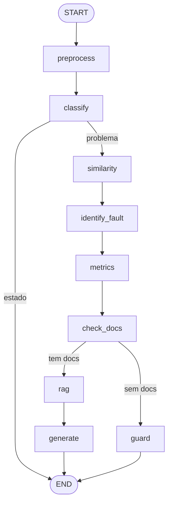

# Pipeline IA (LangGraph)

O pipeline prescritivo roda em Celery e é implementado com LangGraph `StateGraph`.

## Fluxo

## Regra de guarda (anti-alucinação)

Se `check_docs` não encontrar chunks para o defeito identificado, o nó `guard` é acionado: nenhuma instrução é inventada. O campo `is_grounded=False` é gravado na `Prescription`.

## Nós

| Nó | Responsabilidade |
|---|---|
| `preprocess` | Extrai 18 features e normaliza com StandardScaler |
| `classify` | Classifica leitura como estado ou problema |
| `similarity` | ANN L2Distance no pgvector (k=15) |
| `identify_fault` | Voto ponderado por 1/distância |
| `metrics` | Conta ocorrências e frequência |
| `check_docs` | Verifica se há DocumentChunks para o defeito |
| `rag` | Recupera top-5 chunks por CosineDistance |
| `generate` | LLM (gpt-4o-mini) fundamentado nos chunks |
| `guard` | Reporta defeito não documentado |
