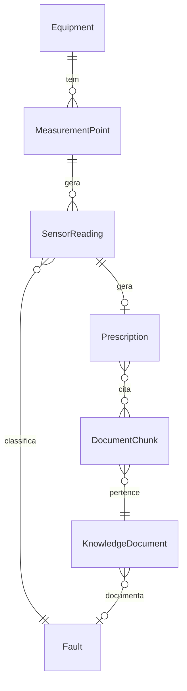

# Modelo de Dados

## Diagrama ER

## Principais modelos

### SensorReading
| Campo | Tipo | Descrição |
|---|---|---|
| `external_id` | CharField | ID original do CSV |
| `metrics` | JSONField | Métricas brutas (18 colunas) |
| `feature_vector` | VectorField(18) | Vetor normalizado para similaridade |
| `fault` | FK Fault | Defeito identificado |
| `status_class` | CharField | `problem`, `state`, `pending` |

### Prescription
| Campo | Tipo | Descrição |
|---|---|---|
| `sensor_reading` | OneToOneField | Leitura que originou a prescrição |
| `instructions` | TextField | Markdown gerado pelo LLM |
| `is_grounded` | BooleanField | `True` se tem base documental |
| `source_chunks` | M2M DocumentChunk | Chunks usados como fonte |

### DocumentChunk
| Campo | Tipo | Descrição |
|---|---|---|
| `embedding` | VectorField(384) | Embedding do texto (MiniLM) |
| `content` | TextField | Trecho do documento |
