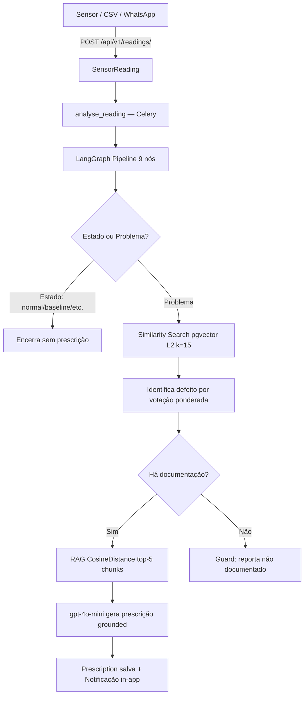

# Visão Geral da Arquitetura

## Stack

| Camada | Tecnologia |
|---|---|
| Backend | Python 3.13 · Django 6.0 · Django REST Framework |
| IA / Pipeline | LangGraph `create_react_agent` · LangChain |
| Embeddings | sentence-transformers `paraphrase-multilingual-MiniLM-L12-v2` (local) |
| LLM | `gpt-4o-mini` via OpenAI (configurável via `LLM_MODEL` no `.env`) |
| OCR (PDF escaneado) | GPT-4o Vision — PyMuPDF renderiza páginas → base64 → GPT-4o extrai texto |
| Banco | PostgreSQL + pgvector (vetores 18-dim e 384-dim) |
| Tarefas async | Celery · RabbitMQ (broker) · Redis (backend + cache) |
| WhatsApp | Evolution API + evolution_redis |
| Infra | Docker Swarm · Traefik (TLS wildcard DNS-01/Cloudflare) |
| Frontend | Django Template Language · CSS customizado (design system FIESC) · Nunito (Google Fonts) |
| Docs | MkDocs Material servido em `/docs/` |

## Apps Django

```
core/           — projeto, settings único, /health/
base/           — TimeStampedModel, mixins de permissão, middleware de media
accounts/       — Custom User, login por e-mail, perfis admin/maintenance/viewer
assets/         — Equipment, MeasurementPoint
monitoring/     — SensorReading (166k registros), ingestão REST/CSV/manual
faults/         — Fault (catálogo, campo is_problem)
knowledge/      — KnowledgeDocument, DocumentChunk, ingestão RAG + OCR
prescriptions/  — Prescription, pipeline LangGraph 9 nós
analytics/      — Dashboard KPIs + Chart.js
reports/        — Exportação PDF/CSV
ai/             — Agente LangGraph, 8 ferramentas, chat SSE, guardrail anti-alucinação
notifications/  — Notificações in-app
whatsapp/       — Webhook + envio via Evolution API
api/            — DRF + drf-spectacular (Swagger)
```

## Redes Docker em produção

| Rede | Serviços |
|---|---|
| `traefik_public` | traefik, app |
| `smpi_v1_internal` | app, postgresql, redis, rabbitmq, evolution_redis, evolution_api, celery_worker, celery_beat |
| `smpi_v1_egress` | evolution_api, celery_worker, celery_beat |

## Fluxo principal


